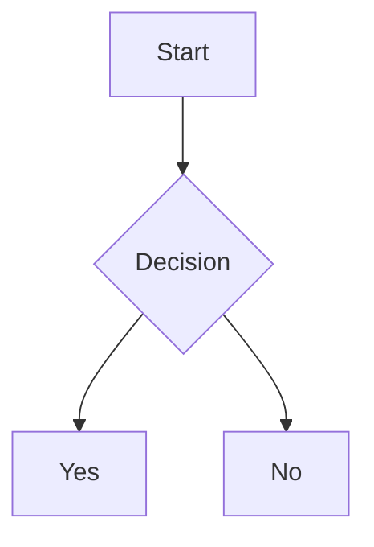

# GitHub Markdown Guide

A comprehensive minimal guide for markdown on GitHub. Keep this handy for quick reference.

# Table of Contents

- [Paragraph Text](#paragraph-text)
- [Heading Text](#heading-text)
- [Text Style](#text-style)
- [Quote](#quote)
- [Code](#code)
- [Link](#link)
- [Line Break](#line-break)
- [Image](#image)
- [List](#list)
- [Emoji](#emoji)
- [Footnote](#footnote)
- [Alert](#alert)
- [Comment](#comment)
- [Ignore Markdown](#ignore-markdown)
- [Table](#table)
- [Collapsed Section](#collapsed-section)
- [Diagrams](#diagrams)
- [Math](#math)
- [Quick Tips](#quick-tips)

# Paragraph Text

Use default text.

# Heading Text

Use `#` symbol.

**Code:**

```
# Heading 1

## Heading 2

### Heading 3

#### Heading 4

##### Heading 5

###### Heading 6
```

**Preview:**

# Heading 1

## Heading 2

### Heading 3

#### Heading 4

##### Heading 5

###### Heading 6

# Text Style

| Style | Code | Preview |
|---|---|---|
| Bold | `**bold**` | **bold** |
| Italic | `*italic*` | *italic* |
| Strikethrough | `~~strikethrough~~` | ~strikethrough~ |
| Bold and italic | `***bold and italic***` | ***bold and italic*** |
| Subscript | `<sub\>subscript</sub>` | <sub>subscript</sub> |
| Superscript | `<sup\>superscript</sup>` | <sup>superscript</sup> |
| Underline | `<ins>underline</ins>` | <ins>underline</ins> |

# Quote

Use `>` symbol.

**Code:**

```
> Quote
```

**Preview:**

> Quote

# Code

Use `` ` `` symbol.

## Inline Code

**Code:**

````
`Inline code`
````

**Preview:**


`Inline code`

To use `` ` `` symbol in inline code.
Use multiple ``` `` ``` symbols  in the start and end of the inline code and block code.

**Code:**
```
``Inline code with a backtick ` ``
```

**Preview:**

``Inline code with a backtick ` ``

## Block code

**Code:**

````
```python
print("Hello, World!")
```
````

**Preview:**

```python
print("Hello, World!")
```

You can specify the programming language (Optional).

# Link

Use `[ ]( )` symbols.

## Normal Link

**Code:**
```
[Google](https://www.google.com)
```

**Preview:**

[Google](https://www.google.com)

## Anchor Link

**Code:**

```
[Table of Contents](#table-of-contents)
```

**Preview:** 

[Table of Contents](#table-of-contents)

## Relative Link

**Code:**
```
[image.png](./image.png)
```

**Preview:**

[image.png](./image.png)

## Custom Anchor Link

**Code:**

```
[Custom Anchor Link](#custom-anchor-point)
```

**Preview:**

[Custom Anchor Link](#custom-anchor-point)

> [!NOTE]
> A custom anchor link must have a corresponding custom anchor point.

**Code:**
```
<a name="custom-anchor-point">Custom Anchor Point</a>
```

**Preview:**

<a name="custom-anchor-point">Custom Anchor Point</a>


# Line Break

Use `\` or `<br/>`

**Code:**

```
Hello,\
World!

or

Bye, <br/> World!
```

**Preview:**

Hello,\
World!

or

Bye, <br/> World!

# Image

Use `` symbols.

**Code:**

```

```

**Preview:**


# List

## Unordered List

**Code:**

```
- Item
* Item
+ Item
```

**Preview:**

- Item
* Item
+ Item

## Sorted List

**Code:**

```
1. Item
2. Item
3. Item
```

**Preview:**

1. Item
2. Item
3. Item

## Nested List

**Code:**
```
- Item
    - Item
        - Item
```

**Preview:**
- Item
    - Item
        - Item

## Task List

**Code:**

```
- [x] Task
- [ ] Task
```

**Preview:**

- [x] Task
- [ ] Task

# Emoji

**Use :emojicode:**

**Input:** `:smile:`

**Output:** :smile:

> [!NOTE]
> For more information check out: [Emoji List Unicode](https://github.com/Fantantonio/Emoji-List-Unicode)

# Footnote

**Code:** 

```
Reference [^1]
```

**Preview:**

Reference [^1]

> [!NOTE]
> A Reference must have a corresponding Footnote

**Code:**
```
[^1]: Footnote
```

**Preview:**

[Jump to footnote](#real-footnote)

[^1]: Footnote <a name="real-footnote"></a>

# Alert

**Code:**

```
> [!NOTE]
> Description
```

```
> [!TIP]
> Description
```

```
> [!IMPORTANT]
> Description
```

```
> [!WARNING]
> Description
```

```
> [!CAUTION]
> Description
```

**Preview:**

> [!NOTE]
> Description

> [!TIP]
> Description

> [!IMPORTANT]
> Description

> [!WARNING]
> Description

> [!CAUTION]
> Description

# Comment

**Use `<!-- Comment -->`**

**Code:**

```
Visible text <!-- hidden comment -->
```

**Preview:**

Visible text <!-- hidden comment -->


# Ignore Markdown

To stop automatically formatting your text as markdown: 
**use `/` symbol**:

**Code:**

```
\*Not italic\*
\# Not a heading
\> Not a quote
```

**Preview:**

\*Not italic\*
\# Not a heading
\> Not a quote

# Table

## Basic Table

**Code:**

```
| Header | Header |
| --- | --- |
| Cell | Cell |
```

**Preview:**

| Header | Header |
|---|---|
| Cell | Cell |

## Table Alignment

**Code:**
```
| Left Alignment | Center Alignment | Right Alignment |
| :--- | :---: | ---: |
| Left | Center | Right |
```

**Preview:**

| Left Alignment | Center Alignment | Right Alignment |
| :--- | :---: | ---: |
| Left | Center | Right |

# Collapsed Section

**Code:**

```
<details>
<summary>Click to expand</summary>
Hidden content here 
</details>
```

**Preview:**

<details>
<summary>Click to expand</summary>
Hidden content here 
</details>

# Diagrams

## Mermaid Diagram

**Code:**

````

````

**Preview:**


## GeoJSON Diagram

**Code:**

````
```geojson
{
  "type": "FeatureCollection",
  "features": [
    {
      "type": "Feature",
      "properties": {
        "name": "Central Park",
        "type": "park"
      },
      "geometry": {
        "type": "Polygon",
        "coordinates": [
          [
            [-73.9819, 40.7681],
            [-73.9581, 40.7681],
            [-73.9581, 40.8006],
            [-73.9819, 40.8006],
            [-73.9819, 40.7681]
          ]
        ]
      }
    },
    {
      "type": "Feature",
      "properties": {
        "name": "Statue of Liberty",
        "type": "monument"
      },
      "geometry": {
        "type": "Point",
        "coordinates": [-74.0445, 40.6892]
      }
    }
  ]
}
```
````

**Preview:**

```geojson
{
  "type": "FeatureCollection",
  "features": [
    {
      "type": "Feature",
      "properties": {
        "name": "Central Park",
        "type": "park"
      },
      "geometry": {
        "type": "Polygon",
        "coordinates": [
          [
            [-73.9819, 40.7681],
            [-73.9581, 40.7681],
            [-73.9581, 40.8006],
            [-73.9819, 40.8006],
            [-73.9819, 40.7681]
          ]
        ]
      }
    },
    {
      "type": "Feature",
      "properties": {
        "name": "Statue of Liberty",
        "type": "monument"
      },
      "geometry": {
        "type": "Point",
        "coordinates": [-74.0445, 40.6892]
      }
    }
  ]
}
```

# Math

Use `$` symbol.

## Inline Math

**Code:**

```
E = mc^2 and $\sqrt{3x-1}+(1+x)^2$
```

**Preview:**

E = mc^2 and $\sqrt{3x-1}+(1+x)^2$

## Math Block

**Code:**

```
$$
\int_{a}^{b} f(x) dx = F(b) - F(a)
$$
```

**Preview:**

$$
\int_{a}^{b} f(x) dx = F(b) - F(a)
$$

> [!NOTE]
> For more information visit: [Katex Docs](https://katex.org/docs/supported.html)

# Quick Tips

---

*Keep this guide handy for quick reference. Contribute via PR.*
